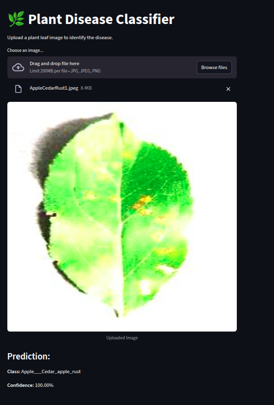

# 🌱 Plant Disease Classifier

A deep learning–based image classifier built with **TensorFlow/Keras** and deployed using **Streamlit**.
This tool helps detect and classify plant leaf diseases, supporting farmers, researchers, and agronomists in early detection and prevention.

---

## 📊 Performance Report

The trained model achieved **96% accuracy** on the test set with excellent performance across 38 plant disease/healthy categories.

**Classification Report (summary):**

* **Accuracy:** 96%
* **Macro Avg F1-score:** 0.96
* **Weighted Avg F1-score:** 0.96

✅ High precision and recall across most classes
⚠️ Slightly lower recall for **Tomato diseases** (e.g., *Septoria\_leaf\_spot*, *Target\_Spot*) — could be improved with more data augmentation.

---

## 🚀 Demo

👉 [Plant Disease Classifier - Streamlit App](https://plantdiseaseclassifier4farmers.streamlit.app/)

Upload a plant leaf image and get instant disease classification with confidence scores.

---

## 📸 Screenshots

**Model Demo:**


---

## 🧠 Model Details

* **Framework:** TensorFlow / Keras (v2.18.0)
* **Architecture:** Convolutional Neural Network (CNN)
* **Optimizer:** Adam (lr=0.0001)
* **Loss Function:** Categorical Crossentropy
* **Metrics:** Accuracy, Precision, Recall, F1-score
* **Model File:** `trained_plant_disease_model.keras`

---

## 📂 Dataset

This project uses the [PlantVillage dataset](https://data.mendeley.com/datasets/tywbtsjrjv/1).

**Preprocessing applied:**

* Image resizing → `(128, 128)`
* Normalization → scaled pixel values to `[0,1]`
* Train/Validation split

---

## ⚙️ Installation & Setup

### 1️⃣ Clone the repository

```bash
git clone https://github.com/Alishan45/plant-desease-classifier.git
cd plant-desease-classifier
```

### 2️⃣ Create & activate environment

```bash
conda create -n plantenv python=3.11
conda activate plantenv
```

### 3️⃣ Install dependencies

```bash
pip install -r requirements.txt
```

### 4️⃣ Run Streamlit app

```bash
streamlit run app.py
```

---

## 📌 Usage

1. Launch the app with Streamlit.
2. Upload a plant leaf image (JPG/PNG).
3. The model predicts the **disease class** + **confidence score**.

Example output:

```
Class: Tomato___Late_blight
Confidence: 97.4%
```

---

## 📈 Future Improvements

* Add **explainability** (Grad-CAM heatmaps to visualize disease regions).
* Expand dataset with **real-field images** (not only lab images).
* Provide **disease descriptions + treatment suggestions** inside the app.
* Optimize model for **mobile deployment** (TensorFlow Lite).

---

## 🤝 Contributing

Pull requests are welcome! If you’d like to contribute:

1. Fork this repo
2. Create a new branch
3. Commit changes
4. Open a PR

---

## 📜 License

This project is licensed under the **MIT License**.

---
